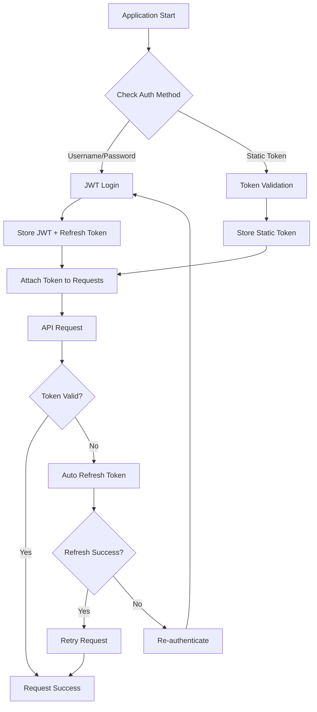

# ThingsBoard Authentication Module

A comprehensive TypeScript authentication module for ThingsBoard IoT platform integration with JWT token management, automatic refresh, and multiple authentication methods.

## Features

- ✅ **JWT Token Management**: Automatic token storage and refresh
- ✅ **Multiple Auth Methods**: Username/password and static token support
- ✅ **Automatic Token Refresh**: Seamless token renewal before expiration
- ✅ **Type Safe**: Full TypeScript interface coverage
- ✅ **SOLID Principles**: Clean, extensible, and testable architecture
- ✅ **Error Handling**: Comprehensive error management and recovery
- ✅ **Singleton Pattern**: Consistent authentication state across the application
- ✅ **Request Interceptors**: Automatic authentication header injection
- ✅ **Environment Configuration**: No hardcoded credentials

## Quick Start

### 1. Environment Configuration

Copy `.env.example` to `.env` and configure your ThingsBoard credentials:

**Username/Password Authentication (Recommended):**
```env
TB_HOST=https://your-thingsboard-instance.com
TB_USERNAME=your-username@domain.com
TB_PASSWORD=your-secure-password
```

**Static Token Authentication (Fallback):**
```env
TB_HOST=https://your-thingsboard-instance.com
TB_API_KEY=your-static-api-key
```

### 2. Basic Usage

```typescript
import { tbClient } from './integrations/thingsboard';

// The client automatically handles authentication
try {
  const devices = await tbClient.get('/api/tenant/devices');
  console.log('Devices:', devices.data);
} catch (error) {
  console.error('API call failed:', error);
}
```

### 3. Advanced Usage

```typescript
import { 
  thingsBoardClientInstance, 
  tbClient, 
  isThingsBoardAuthenticated 
} from './integrations/thingsboard';

// Check authentication status
if (!isThingsBoardAuthenticated()) {
  console.log('Not authenticated, triggering login...');
  await thingsBoardClientInstance.authenticate();
}

// Make API calls
const response = await tbClient.post('/api/device', deviceData);

// Logout when done
thingsBoardClientInstance.logout();
```

## Architecture

### Authentication Flow



### Project Structure

```
backend/src/integrations/thingsboard/
├── auth.interfaces.ts     # TypeScript interfaces
├── auth.service.ts        # Authentication service implementation
├── client.ts             # Authenticated HTTP client
├── endpoints.ts          # API endpoint builders
├── index.ts              # Central exports
└── entity_management.ts  # Legacy entity operations
```

### Key Components

#### 1. Authentication Service (`auth.service.ts`)
- `ThingsBoardAuthService`: Core authentication logic
- JWT token lifecycle management
- Automatic token refresh
- Multiple authentication strategies

#### 2. HTTP Client (`client.ts`)
- `ThingsBoardClient`: Authenticated Axios wrapper
- Request/response interceptors
- Automatic token attachment
- Token refresh on 401/403 errors

#### 3. Type Definitions (`auth.interfaces.ts`)
- Full TypeScript interface coverage
- Authentication request/response types
- Configuration interfaces
- Error handling types

## API Reference

### ThingsBoardAuthService

```typescript
class ThingsBoardAuthService implements IThingsBoardAuth {
  authenticate(): Promise<string>
  getAccessToken(): Promise<string>
  isTokenValid(): boolean
  refreshAccessToken(): Promise<string>
  clearTokens(): void
  getAuthHeaders(): Promise<Record<string, string>>
}
```

### ThingsBoardClient

```typescript
class ThingsBoardClient {
  getClient(): AxiosInstance
  authenticate(): Promise<void>
  isAuthenticated(): boolean
  logout(): void
  getAccessToken(): Promise<string>
}
```

### Exported Functions

```typescript
// Convenience functions
isThingsBoardAuthenticated(): boolean
authenticateThingsBoard(): Promise<void>
logoutThingsBoard(): void
```

## Configuration Options

### Environment Variables

| Variable | Required | Description |
|----------|----------|-------------|
| `TB_HOST` | ✅ | ThingsBoard server URL |
| `TB_USERNAME` | ⚠️ | Username for JWT auth |
| `TB_PASSWORD` | ⚠️ | Password for JWT auth |
| `TB_API_KEY` | ⚠️ | Static token for fallback auth |

⚠️ Either `(TB_USERNAME + TB_PASSWORD)` OR `TB_API_KEY` must be provided.

### Token Configuration

```typescript
export interface ThingsBoardConfig {
  host: string;
  auth: {
    username?: string;
    password?: string;
    staticToken?: string;
  };
  timeouts: {
    auth: number;      // Default: 10000ms
    request: number;   // Default: 30000ms
  };
  token: {
    refreshThresholdMinutes: number; // Default: 5 minutes
  };
}
```

## Error Handling

The module provides comprehensive error handling:

```typescript
try {
  const response = await tbClient.get('/api/tenant/devices');
} catch (error) {
  if (error.response?.status === 401) {
    console.log('Authentication failed');
  } else if (error.response?.status === 403) {
    console.log('Insufficient permissions');
  } else {
    console.log('API error:', error.message);
  }
}
```

## Best Practices

### 1. Use Username/Password Authentication in Production
```typescript
// ✅ Recommended
TB_USERNAME=service-account@company.com
TB_PASSWORD=secure-password

// ❌ Avoid in production (use only for development)
TB_API_KEY=static-token
```

### 2. Handle Authentication States
```typescript
// Check authentication before critical operations
if (!isThingsBoardAuthenticated()) {
  await authenticateThingsBoard();
}
```

### 3. Implement Proper Error Handling
```typescript
// Handle specific ThingsBoard errors
try {
  await tbClient.post('/api/device', data);
} catch (error) {
  if (error.response?.data?.errorCode === 'DEVICE_NOT_FOUND') {
    // Handle specific business logic error
  }
}
```

### 4. Use TypeScript Interfaces
```typescript
import { LoginRequest, AuthResponse } from './integrations/thingsboard';

const loginData: LoginRequest = {
  username: 'user@example.com',
  password: 'password'
};
```

## Migration Guide

### From Static Token to JWT Authentication

If you're migrating from the old static token approach:

1. **Update Environment Variables**:
   ```env
   # Old approach
   TB_API_KEY=static-token
   
   # New approach (preferred)
   TB_USERNAME=user@domain.com
   TB_PASSWORD=secure-password
   
   # Keep TB_API_KEY as fallback if needed
   ```

2. **Update Import Statements**:
   ```typescript
   // Old
   import { tbClient } from './integrations/thingsboard/client';
   
   // New (same import, enhanced functionality)
   import { tbClient } from './integrations/thingsboard';
   ```

3. **No Code Changes Required**: The `tbClient` interface remains the same, but now includes automatic authentication management.

## Troubleshooting

### Common Issues

1. **"Authentication configuration required" Error**
   - Ensure either `TB_USERNAME/TB_PASSWORD` or `TB_API_KEY` is set
   - Check `.env` file loading in your application

2. **"Token validation failed" Error**
   - Verify your static token is valid and not expired
   - Check ThingsBoard server connectivity

3. **Repeated Authentication Attempts**
   - Check if your username/password credentials are correct
   - Ensure ThingsBoard server allows API access for your user

### Debug Mode

Enable detailed logging for authentication issues:

```typescript
// Add to your application startup
process.env.NODE_ENV === 'development' && console.log('ThingsBoard Config:', {
  host: TB_CONFIG.host,
  hasUsername: !!TB_CONFIG.auth.username,
  hasStaticToken: !!TB_CONFIG.auth.staticToken,
});
```

## Contributing

This module follows SOLID principles and clean architecture patterns. When extending functionality:

1. **Single Responsibility**: Each class has one clear purpose
2. **Open/Closed**: Use interfaces for extension points
3. **Liskov Substitution**: Implement proper inheritance
4. **Interface Segregation**: Keep interfaces focused and minimal
5. **Dependency Inversion**: Depend on abstractions, not concretions

## License

This module is part of the IIoT Platform project.